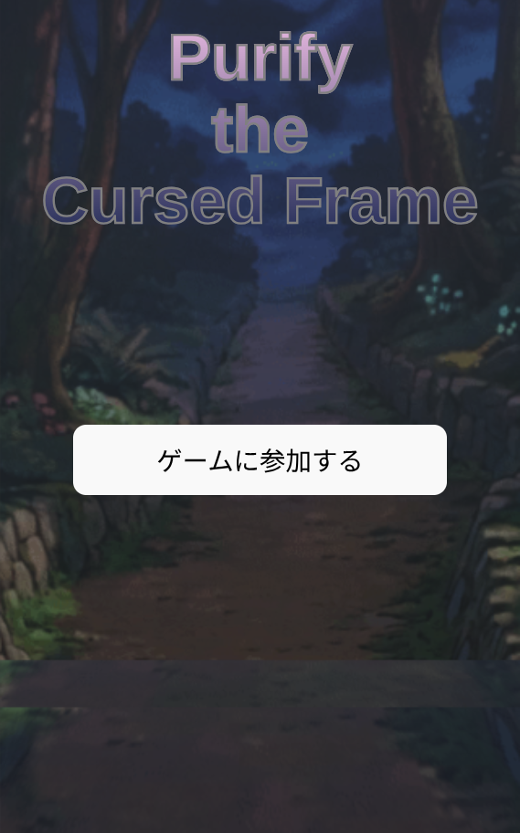
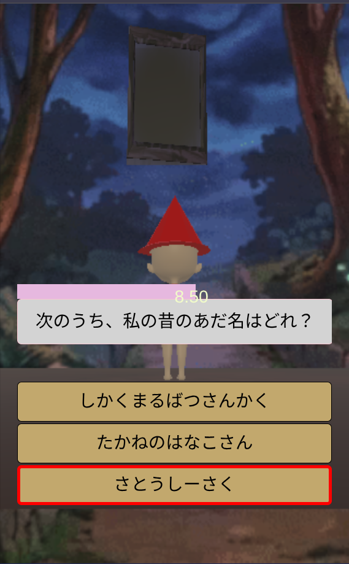
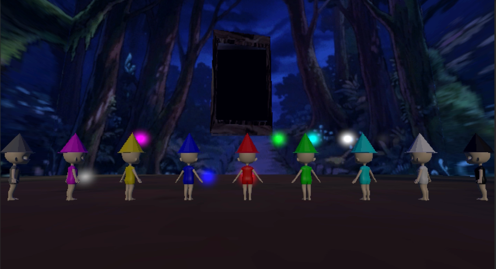

# Purify the Cursed Frame

[](https://github.com/itsabush1003/cursed-frame/actions/workflows/build-root.yml)
[](https://opensource.org/licenses/MIT)

> **これは、大体10人〜60人弱程度の小・中規模なチームにおいて、親睦を深めることを目的としたミニゲームです**





## 概要

このゲームはいわゆるクイズゲームの一種だが、一般常識に関する質問ではなく、ゲームに参加している他のプレイヤーに関する質問が出題される。
その質問に答える過程で、他のプレイヤーのことを考える切っ掛けを作れればと思っている。

### 制作背景

このゲームのアイデアは、私が新入社員だった頃に生まれたもので、所属部署の懇親会に際して部署長から、私たち新入社員も含めた部署のメンバー間の親睦を深めるような娯楽イベントを企画してほしいと依頼されたのがきっかけである。  
当時、私はその会社がリリースしていたクイズゲームが好きで、そのゲームは、プレイヤー自身であ​​る魔法使いの主人公が、カードとして登場する数人の仲間にクイズに答えることで力を分け与え、敵を攻撃できるようにするというものだった。この設定と、数週間前に社長が新入社員研修で言っていた「競争と協力」という概念、そして懇親会の目的が、私の頭の中で噛み合った。  
残念ながら、この企画は当時実現しなかった。時間や自分の技術力など、必要なリソースが全て不足していたためである。それでも、これを諦めるのは惜しいと感じ、個人的なプロジェクトとしてこの企画を進めることにした。

## 特徴・工夫した点

- 参加しやすいブラウザゲームという形式
  - 使っているデバイスの種類や仕様に関わらず、一定レベルの安定した動作が保証され、野良アプリをインストールするという面倒な手順やそのための容量も不要
- ユーザー自身が提供した情報に基づいてクイズを作成
  - 参加者に対して実際にアンケートを実施し、その回答をクイズの選択肢として活用することで、個人情報を得られるだけでなく、同じアンケートに回答したことによる連帯感の醸成、正解以外の選択肢への関心の喚起、ゲーム内世界と現実世界との繋がりを強化することによる没入感の向上も期待できる
- 全体と個人の画面の分離
  - 通信におけるホストとゲストの関係を利用することで、全体の情報はホストの画面に表示され、個別の情報はゲストの画面に表示されるため、ゲストの小さな画面に大量の情報を詰め込む必要がなくなる
- チーム間の競争と協力
  - 全体としては、世界観や設定によって、全てのチームで協力するという方向性を持たせつつ、個人および各チームの貢献を可視化することで競争意識を生むことを目指した

## 技術スタック

| カテゴリー     | 技術                                          |
| :------------- | :-------------------------------------------- |
| フロントエンド | React(v19), TypeScript, Emotion, Unity(WebGL) |
| バックエンド   | Go(1.25)                                      |
| データベース   | SQLite                                        |
| ライブラリ     | Connect, React-Unity-WebGL                    |
| CI/CD          | Github Actions                                |

### 選定理由

- React & TypeScript: Webフロントエンドのデファクト・スタンダードになっており、エコシステムが充実していることに加え、インタラクティブなUIをコードベースで管理しやすいため
- Emotion: スタイリングに生のCSSを使用するため、細かい調整が可能であり、デザインを各コンポーネント内に収めることができるため
- Unity(WebGL):　ノンリアリスティックで軽量な3Dゲームを作成でき、ブラウザゲームとして出力することが容易なため
- Go: このプロジェクトが、多数のユーザーによる同時通信を前提としていたため、それに必要な並行・並列処理が軽量で記述しやすく、さらにクロスプラットフォーム対応も容易なため
- SQLite: 工数と外部要素をできる限り最小限に抑えられる、バックエンドのGoに組み込めるストレージであったため
- Connect: フロントエンドとバックエンドの間の接続をコードベースで共通化でき、コア機能の実装に必要なサーバーストリーミングも容易に実現できるため
- React-Unity-WebGL: 必要な画面の中には、管理パネルなど、ゲームらしくない画面もいくつかあったことに加え、Reactを使うことで、コードを使ってUIを管理することができるため

## アーキテクチャ

```
[Browser] -> [React] <-[Connect/REST API]-> [Golang] <-> [SQLite]
                ^
                | [React-Unity-WebGL]
                v
              [Unity]
```

アーキテクチャの詳細は[こちら](architecture.md)を参照

## 遊び方

### 事前準備

- オンプレミスまたはクラウド上でインターネット経由で公開アクセス可能なサーバーとして使用できるマシン
  - ngrok
  - GCE
  - EC2
  - Google Cloud Run
  - AWS Lambda
  - Azure Container Apps
  - etc...
    - もしコンテナとしてデプロイしたい場合は、現状ではイメージを自分で作成する必要があります

もしソースコードからビルドしたい場合（質問項目をカスタマイズしたい場合など）は

- Unity ^2022.3
- bun ^1.3
- go ^1.25

が追加で必要

### セットアップ

バイナリをreleasesからダウンロード

```bash
gh release download -R itsabush1003/cursed-frame
```

Or

```bash
curl -LO https://github.com/itsabush1003/cursed-frame/releases/latest/download/cursed_frame
```

または各自のマシン上でソースコードからビルド

```bash
# repositoryをクローン
git clone https://github.com/itsabush1003/cursed-frame.git
cd cursed-frame

# build unity project
cd frontend/Unity/CursedFrame
your/unity/execution/path/Unity -quit -batchmode -nographic -projectpath . -buildTarget WebGL ../build/
# ビルド成果物をサーバが使えるディレクトリにコピー
cd ../build
cp WebGL/CursedFrame/Build/* ../../../backend/golang/dist/webgl/

cd ../../../

# build react project
cd frontend/react/cursed-frame
# Reactの参照先をUnityがビルドしたWebGL用ファイルのプレフィックスに合わせる
echo "VITE_UNITY_WEBGL_NAME=CursedFrame" > .env.local

bun run build
# ビルド成果物をサーバが使えるディレクトリにコピー（してくれるスクリプトを起動）
bun run deploy

cd ../../../

# build golang
cd backend/golang

# もし参加者に出す質問をカスタマイズしたいなら
# ビルド前にmigration/Master/ProfileQuestion.csvを変更する

go build . -o cursed_frame

cd ../../
```

### ゲームを始める

```bash
backend/golang/cursed_frame -N {total_participants_number} -T {separated_team_number} [-domain {domain_which_the_server_started}]
```

サーバが起動したら、次のように画面に２つのパスが表示される。

```
admin: <your_domain>:8888/[randam strings]/admin
guest: <your_domain>:8888/[random strings]/guest
```

１つ目の「admin」で終わるパスは管理者であるあなた用のもので、２つ目の「guest」で終わるパスは参加者用のものである。
そのため、２つ目のパスは参加者に周知する必要があるが、１つ目のパスは決して他の参加者に教えてはならない。  
また、参加者にパスを伝える際、画面に表示されたパスだけではなく、あなたがこのサーバを起動したマシンにアクセスするためのドメインも合わせて伝えることを忘れないように。  
（上記`<your_domain>`のところには、サーバを起動した際に引数でドメインを指定していた場合はそれが表示されるが、引数を指定しなかった場合には表記通り`<your_domain>`と表示される）  
その後、管理者用のパスにアクセスし、右の「参加登録を受け付ける」というボタンを押すと、ゲームを始める準備が整うので、参加者にパスを伝える。
その後、全参加者の準備が整ったら、参加を締め切り、画面上の表示に従って進めれば良い。

もしより詳細な操作とそれに伴う画面遷移を確認したい場合は [こちら](screen_transitions.pdf)を確認してほしい。

## 謝辞

- [React-Unity-WebGL](https://github.com/jeffreylanters/react-unity-webgl) - これは素晴らしいライブラリで、これがなければ、このゲームを作り始めることすらできなかっただろう
- [Chibi_body](https://booth.pm/ja/items/5638034) - プレイヤーが支援するキャラクター（ゲーム上では「魔法使い」と呼んでいる）の3Dモデルは、このモデルを基に作成された
