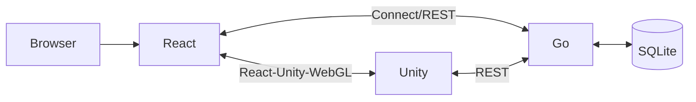

# Architecture

## Application Architecture Diagram



## Intention of Directory Structure

### Repository Layout

Chose a monorepo configuration because the application is not very large, and it makes it easier to share RPC definitions using Protocol Buffers, which is the foundation of Connect, between the frontend and backend.

```
cursed-frame/
 |- .github/        # GitHub Actions and other GitHub-related configuration files
 |- backend/golang/ # Backend API and file server maid by Go
 |- frontend/
     |- react/      # Frontend to controll UI and to communicate server
     |- Unity/      # Frontend for rendering 3D graphics
 |- docs/           # Document files like this
 |- images/         # Images for showcasing the game's visuals
 |- proto/          # Definitions of RPC
```

### Backend(Go)

Make it as close to a clean architecture as possible.

```
golang/
 |- dist/               # Static files for distribution, artifacts of frontend are stored here
 |- internal/           # Since there is no code that needs to be exposed externally, everything is placed here
     |- controller/     # Handling requests from network, as an interface layer
         |- middleware/ # Middlewares and Interceptors
         |- file/       # Serving static files on dist directory
         |- rest/       # Handling REST requests, in this case, handle to upload/download images, which RPC tends to struggle with due to its large data size
         |- rpc/        # Handling Connect RPC requests
     |- core/           # Core logics of game and communication hub between admin and guests, an enterprise rules layer
     |- gen/            # Files generated by protoc, a frameworks and drivers layer
     |- infra/          # Specific interactions with external elements and server configurations, as a frameworks and drivers layer
     |- model/          # Domain models, as an enterprise rules layer
     |- repository/     # Abstracting interactions with data storage, as an interface layer
     |- usecase/        # Application logics, as an application rules layer
     |- util/           # Utility functions
 |- migration/          # Initial data of database
     |- Master/         # Master data
 |- go.mod
 |- go.sum
 |- main.go             # Entrypoint of server, and the reason this is placed at the top level is to embed the 'dist' and 'migration' directory
```

### Frontend(React)

This was my first time using React, and I wasn't very familiar with it, in addition, my initial plan only involved a small number of screens (about three: title screen, quiz screen, and results screen), and furthermore, I couldn't think of any components that could be common across all screens. Therefore, I adopted a type-based directory structure, which is commonly used in Go and other languages ​​I am more familiar with.
However, after encountering various pieces of information during the implementation process, I've come to feel that a feature-based directory structure might have been better, even if it meant fewer components could be shared, and I'd like to switch to that in the future.

```
react/cursed-frame/
 |- public/             # Static resources for publishing
 |- src/                # Root directory
     |- components/     # A so-called presentational component that only has its own state and determines what and how it is displayed
     |- context/        # Global context
     |- gen/            # Generated files by protoc
     |- hooks/          # Custom hooks
     |- pages/          # Similar to a so-called container component that handles page layout and external communication via hooks
     |- services/       # Codes that handles external communication
         |- api/        # Handling REST API access, in this case, used only upload/download images
         |- repository/ # Handling storage access
         |- rpc/        # Handling RPC
         |- unity/      # Handling communication to unity component
     |- utils/          # Utility functions
     |- App.tsx         # Main component, controll unity component and all other components
     |- index.css       # CSS to apply to the entire app
     |- main.tsx        # Entrypoint
     |- vite-env.d.ts   # Type definitions for environment variables
 |- .env                # Environment variables, the reason of making this public is that I currently have no plans to store confidential information in environment variables
 |- bun.lock
 |- eslint.config.js
 |- index.html
 |- package.json
 |- tsconfig.*.json
 |- vite.config.ts
```

### Frontend(Unity)

Follows the standard Unity directory structure without any particular modifications, because since its primary use is simply as a renderer, it doesn't have the extensive interaction and state management found in typical games, and it has few scenes.

```
Unity/CursedFrame/
 |- Assets/
     |- Animations/
     |- Materials/
     |- Models/
     |- Plugins/
         |- Demigiant/  # Plugins for DOTween
         |- WebGL/      # Definitions of functions to communicate to React with React-Unity-WebGL library
     |- Prefabs/
     |- Resources/
     |- Scenes/
     |- Scripts/        # Implementation controllers of each elements
     |- Shaders/        # Custom shaders
     |- Textures/
 |- Packages/
 |- ProjectSettings/
```
